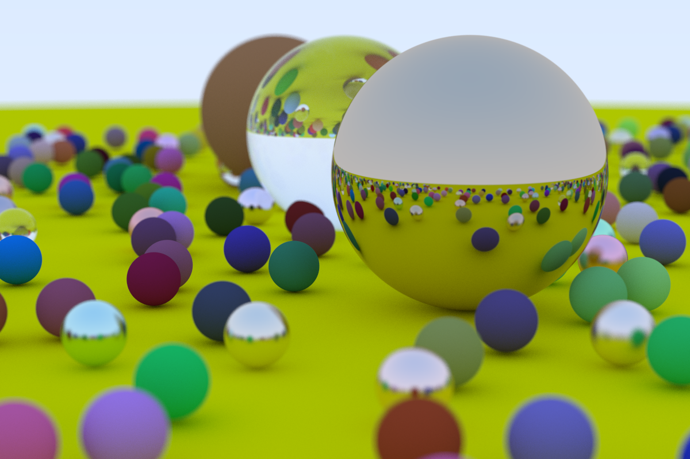
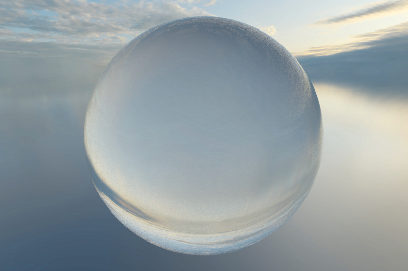
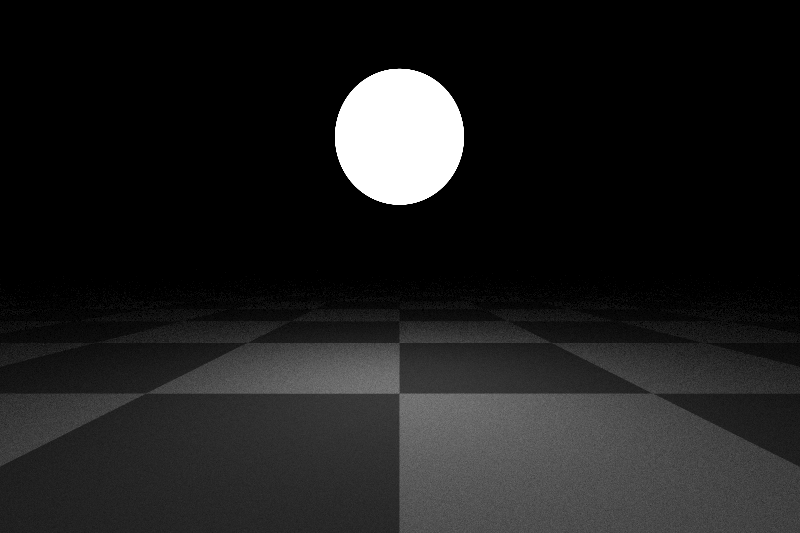

# ray-tracer

An ray-tracer written with the intent of learning rust. Largely based on [Ray Tracing in One Weekend
 by Peter Shirley](https://raytracing.github.io/books/RayTracingInOneWeekend.html), with some additional
 features.

 Current features:
 * Primitive shapes (Spheres, Planes, Triangles)
 * Supports .obj meshes
 * Texture mapping
 * Light emitting materials
 * Sky textures
 * Parallel rendering

## Examples

